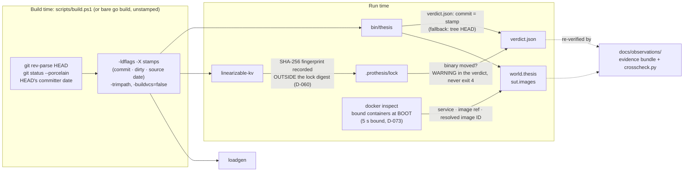

# PRO-THESIS

By **Senan Sumrein**.

A fault-injection gate for distributed systems, built to be run by a loop that
reads nothing but an exit code.

It orchestrates a full test lifecycle end to end: it boots a containerised
cluster from an ordinary Docker Compose file, drives clients against it,
injects scheduled network and process faults, records what the clients saw,
and asks oracles whether that history is one a correct system could have
produced. Then it answers with one of four things, and the answer is locked so
that the test cannot be quietly weakened by whoever, or whatever, is being
tested.

Go, one dependency, Docker. Two targets: a reference Raft store with one
planted defect, and upstream etcd. Every number below was measured, and the
section [What is not yet proven](#what-is-not-yet-proven) is as much a part of
the description as the rest.

---

## Four answers

The exit code is the product. Everything else in this repository exists so
that the code can mean what it says.

| Exit | Answer | What has to be true for the code to be emitted | How that was measured |
|---|---|---|---|
| `0` | **Pass.** Every planned world ran to ASSERT and no oracle found a violation. | Every oracle returned `ok`. A run narrowed by `--worlds` or `--budget` below its locked profile cannot report this (D-059). | Asserted on every push to `master` by [`ci.yml`](.github/workflows/ci.yml): the fixture with its defect patched (`KV_VARIANT=kvfixed`), etcd with no faults, and etcd with linearizable reads under a leader partition. |
| `1` | **Fail.** An oracle proved a violation and named its witness. | `violations[]` in `verdict.json` carries the oracle, the witness operation ids and the proof. | Asserted on every push for the planted fixture defect and for etcd's serializable reads. Measured in the launching shell, on the line after the call, in [OBS-LIVE-001](docs/observations/2026-09-17-OBS-LIVE-001/record.md) (runs 2 to 4), [OBS-LIVE-002](docs/observations/2026-09-19-OBS-LIVE-002/record.md), and a sample of twenty fresh worlds (20 of 20; run ids in OQ-054). |
| `2` | **Nothing was proven.** The harness could not reach a verdict and refuses to guess. | An oracle that crashes, hangs, emits malformed output, or lacks the probe it needs returns `inconclusive`, never `ok`. One `inconclusive` takes the run to `2`; passing oracles cannot outvote it. | `TestExternalOracleReportsInconclusive`, `TestExternalOracleThatHangsIsKilledAndIsInconclusive`, `TestAnExternalInconclusiveTakesTheRunToExitTwo` in [`internal/oracle/external_test.go`](internal/oracle/external_test.go); `TestAvailabilityWithNoDeclaredProbeIsInconclusive`. Seen live: the two fixture-only oracles return `2` on every etcd world when enabled (OQ-063). |
| `4` | **Someone changed the test.** A locked definition moved without a recorded reason. | [`.prothesis/lock`](testdata/kvfixture/.prothesis/lock) digests every oracle definition and nine configuration keys (`harness.health`, `harness.role_probe`, `oracles.builtin`, `oracles.dir`, `perturber.allow`, `perturber.budget`, `perturber.deny`, `profiles`, `search`). Every `thesis run` re-derives the digest before any container starts; a mismatch is `4`. Only `thesis oracles lock --reason "…"` moves it, and the reason is committed with the lock. | Adversarial probe A4 widens a lock-covered budget and requires exit `4` ([`scripts/adversarial.ps1`](scripts/adversarial.ps1)); [`internal/lock/lock_test.go`](internal/lock/lock_test.go), [`cmd/thesis/oracles_test.go`](cmd/thesis/oracles_test.go). CI runs `thesis oracles verify` against both committed locks before any live world. |

Two more codes are not verdicts. `3` (`BUDGET_EXHAUSTED`) means the run stopped
before its worlds were done, so do not merge on it. `5` (`CONFIG_ERROR`) means
the configuration is invalid.

**What `4` does not cover.** The oracle *executables* are fingerprinted outside
the digest. A swapped, rebuilt or missing checker binary is a WARNING in the
verdict (`oracle_lock.executables_moved`), not exit `4`, because a routine
rebuild would otherwise be an incident that trains people to re-lock without
reading (D-060; the measured gap is OQ-057). The lock is a review aid, not a
sandbox: see [Security model](#security-model).

---

## What a run leaves behind

Every world writes the same files. The
[OBS-LIVE-002 bundle](docs/observations/2026-09-19-OBS-LIVE-002/evidence/r_2026_09_19_151f/)
is one world committed verbatim, so each line below can be checked against a
real file.

| File | What it is |
|---|---|
| `verdict.json` | `prothesis.verdict/v1`: run id, profile, the build's commit stamp, the verdict, budget use, `violations[]` with witnesses, coverage, `oracle_lock {status, manifest_sha}`, artifact paths. |
| `world-NNNN/world.thesis` | `prothesis.world/v1`, canonical JSON, content-addressed. Seed, topology variant, driver profile, the fault schedule as **planned** and as **realized** (which node `role:leader` bound to, and the millisecond at which injection actually landed), phase timings, and `sut.images`: the resolved image ID, not the tag. The loader re-encodes and byte-compares on every read, so an edited world is rejected rather than silently re-hashed. |
| `world-NNNN/history.jsonl` | One JSON object per line, Jepsen-shaped: `invoke` / `ok` / `fail` / `info` per operation, with `info` meaning "may or may not have taken effect", plus the phase markers. |
| `world-NNNN/phases.jsonl`, `plan.json`, `oracle_input.json`, `result.json`, `final_state.json`, `logs/` | Phase transitions with nanosecond timestamps; the driver's plan; exactly what the external oracle was handed; the per-world outcome; the post-QUIESCE state; every node's log. |

The witness from that bundle, as the oracle wrote it into `verdict.json`:

> key "k/0": no linearization exists for the 577 operation(s) on this key
> under a last-write-wins register. The search space was exhausted (2869
> state(s) explored over 10435 step(s)) with every branch rejected; this is a
> WITNESSED failure, not a timeout and not a budget. The deepest partial
> linearization the search reached placed 356 of 577 operation(s) on this key.
> At that point the register held 13000190, written by op 2924, and op 2962
> (process 10, read) returned 4000170. That value was written by op 2805,
> which every linearization places before the value the register held.

An independent observer's script
([`crosscheck.py`](docs/observations/2026-09-17-OBS-LIVE-001/crosscheck.py))
reconstructs the witness from the raw history without the oracle, and counts
hard real-time stale reads by its own criterion: 72 and 46 in OBS-LIVE-001's
two runs, 50 in OBS-LIVE-002.

---

## Run it

Go 1.22 or later, Docker Engine or Docker Desktop with Compose v2, Linux
containers. Developed on Windows with Docker Desktop; CI runs on GitHub's
Ubuntu 24.04 runners. These are the commands CI runs.

```bash
go build -o bin/thesis ./cmd/thesis
go build -o testdata/kvfixture/bin/linearizable-kv ./cmd/thesis-oracle-linearizable
(cd testdata/kvfixture && go build -o bin/loadgen ./cmd/loadgen)

cd testdata/kvfixture
docker compose build
../../bin/thesis oracles verify        # the lock matches the committed definitions

../../bin/thesis run --profile linear --fault 'net.partition(role:leader)@3000..7500'
echo $?                                # 1: the planted defect, with a witness

KV_VARIANT=kvfixed docker compose build
KV_VARIANT=kvfixed ../../bin/thesis run --profile linear --fault 'net.partition(role:leader)@3000..7500'
echo $?                                # 0: the same fixture with the defect patched
```

On Windows, `pwsh -File scripts/build.ps1` builds the same three binaries with
build provenance stamped in: the commit, the dirty flag and the commit's source
date (D-070, D-072). `-Verify` builds twice and proves the bytes identical. The
compose and run steps are the same with `.exe`. Bare `go build` also works and
is what CI does; the stamp is what lets `verdict.json` name the build rather
than the tree it ran in.

Expect a warning about the checker binary on first run: the lock records the
SHA-256 of the one built on the author's machine. Compose rebuilds the fixture
image before every world, which the variant lock depends on, and the rebuild is
cheap. Measured on the build host, the first world on an empty build cache
spends 20 s in BOOT and 34 s in all, writing about 520 MB of cache; after that,
BOOT is 7.5 s, a whole world takes 21 s, and the cache does not grow (OQ-068).

For the second target (three unmodified etcd members, a pre-registered
prediction, and the verdict re-derived from etcd's own revision numbers), see
[`targets/etcd/README.md`](targets/etcd/README.md).

---

## What has been measured

Each row names where the measurement lives. Run directories under
`.prothesis/runs/` are gitignored, so run ids are checkable on the machine that
produced them and in the two committed bundles; everything else is in the tree.

| Claim | Evidence |
|---|---|
| The planted defect is found | Fixture `FAIL`, exit `1`, asserted on every CI push. A sample of twenty fresh worlds (`--seed 1` to `20`) on clean, stamped binaries: 20 of 20 `FAIL`, exit `1`; the one-sided 95% lower bound on the per-world rate from twenty distinct plans is 0.86 (OQ-054). |
| The patched build is not accused | `-tags kvfixed` fixture `PASS`, exit `0`, on every CI push; adversarial probe A1. |
| The checker discriminates on a system nobody here wrote | etcd v3.5.17: linearizable reads `PASS` 2/2 worlds (`r_2026_09_15_8c77`), serializable reads `FAIL` on `linearizable.kv` (`r_2026_09_15_9a29`), both as pre-registered and both re-asserted in CI. Re-derived from etcd's `header.revision`: 313 revision-stale reads in the failing arm, 0 in the passing one ([`targets/etcd/README.md`](targets/etcd/README.md)). |
| A violation is a proof, not a timeout | The oracle reports the exhausted search: 2,869 states over 10,435 steps for the 577 operations on `k/0`, witness ops 2805 / 2924 / 2962 (OBS-LIVE-002). The witness reconstructs from raw records without the oracle (`crosscheck.py`, criteria C1 to C3, reported in both records). |
| The witness cites evidence that exists | Adversarial probe A6. |
| Oracles fail closed | The four tests named under exit `2` above; `TestExternalOracleUnderACancelledContextIsInconclusiveNotViolated`. |
| The gate is locked | Probe A4; `TestHandEditedLockIsMismatch` and the rest of [`internal/lock/lock_test.go`](internal/lock/lock_test.go); CI's `oracles verify` step. |
| Worlds are content-addressed and cannot be hand-edited | Probe A5 round-trips every stored world byte for byte; `TestUnmarshalCanonicalRejectsNonCanonical`, `TestUnmarshalCanonicalAcceptsItsOwnOutput` ([`internal/recorder/cjson`](internal/recorder/cjson/)); `TestStoreWorldNoClobberRefusesToLoseARegression`. |
| HEAL restores the network and the processes | Probe A3 pairs the nastiest faults and checks the residue; CI's `residue` step lists any container or network left behind. |
| `role:leader` binds through a probe the target declares, at injection time | Resolved to `kv-n2` in all twenty sample worlds, recorded in each `world.thesis` as `realized`; on etcd, `r_2026_09_15_d939` and `r_2026_09_15_fa3e` (D-066). |
| DRIVE spans PERTURB, so the fault lands under load | All 25 worlds checked on the current lifecycle record it: the twenty-world sample, OBS-LIVE-002, and four worlds recorded for OQ-068 (D-071). |
| The verdict names the build, and the world names the image | `verdict.commit` is the stamp compiled into the binary (D-070); `scripts/build.ps1 -Verify` proves two builds of one commit byte-identical (D-072); `sut.images` in OBS-LIVE-002's `world.thesis` is `sha256:f833e5d8…`, resolved from `docker inspect` at BOOT. |
| Image identity is stable across rebuilds | Three consecutive worlds on one build cache record one `sut.images` digest; the harness switches off buildx's default attestations on every docker call, and the fixture's build context excludes its own run corpus (D-078, OQ-068). |
| A sick Docker daemon costs a world its provenance, not its budget | Image resolution is bounded at five seconds behind a seam, pinned by six tests, each proven by mutation (D-073). |
| The suite passes on a second machine | CI runs on every push to `master` (this repository's Actions tab). On the first public commit, 2026-09-21: Go 1.27.1 with the Docker-backed tests and the race detector, 1,566 pass · 3 skip · 0 fail; Go 1.22.12, 1,564 pass · 5 skip · 0 fail; live job green with all five exit codes asserted (1, 0, 0, 0, 1, each as wanted). Build host, same code: `scripts/run-tests.ps1`, 32 packages ok, 0 not ok, 38 total. |

---

## What is not yet proven

Stated here so a reader does not have to find it.

- **The guided search has never influenced a decision.** Across all 30
  recorded Saboteur runs, `informed_selections` is `0`: the utility the tree
  exists to accumulate has never been read to choose anything, because an
  unvisited child scores `+Inf` and the budgets never exceeded the ladder
  (OQ-060; predicted analytically in D-015). Treat `thesis search` as a
  hand-written escalation ladder plus a probe sweep.
- **Operation-level shrinking has never completed end to end.** The shrinker
  reduces the workload and the driver executes the reduced plan verbatim
  (D-056), but against etcd the confirmation gate refused all three attempts
  at 1/3: a timing race is hit less often by a shorter trace, which breaks
  ddmin's monotonicity assumption. That is the gate working; it is not a
  shrunk trace carried through it (OQ-052, OQ-063).
- **The k/k confirmation gate assumes a determinism the target does not
  have.** Replaying the one committed regression world nine times reproduced
  it seven (OQ-054). That world,
  [`w_e952.thesis`](testdata/kvfixture/.prothesis/regressions/w_e952.thesis),
  is `net.partition(kv-n2)@3000..7500`, recovered by fault-level shrinking
  from a fourteen-fault schedule and confirmed 3/3 before entry. It was
  recorded on an earlier lifecycle, so its `sut.images` is empty and its DRIVE
  does not span its PERTURB.
- **`thesis bisect` has a unit test and no recorded live run.** The world file
  carries the image it ran against (D-070), which is what a sound bisect
  needs; nothing has been bisected yet.
- **Twelve of the seventeen fault kinds have never been realized in a recorded
  world.** Over the 798 fixture world files on the build host, the kinds that
  actually landed are `net.latency` (368), `net.partition` (306), `net.loss`
  (211), `proc.pause` (80) and `proc.kill` (51). The other twelve
  (`net.reorder`, `net.duplicate`, `net.bandwidth`, `proc.restart`,
  `proc.slow`, and the whole clock, I/O, memory and descriptor families) have
  injectors and unit tests and have realized zero times. Only `net.partition`
  has a pre-registered, CI-asserted verdict attached to it.
- **The model-driven search strategy is unvalidated.**
  `thesis search --strategy llm` asks an OpenAI-compatible endpoint for each
  world's schedule and puts every proposal through the ordinary parser and
  perturber policy (D-075). It has not yet been run on a stamped build with a
  full profile. A proposal stream is not reproducible from a seed; the audit
  trail is `llm-proposals.jsonl` (OQ-069).
- **Two built-in oracles need things a third-party image may not have.**
  `no_unbounded_queue` needs a `/status` endpoint and
  `resource_return_to_baseline` needs a shell in the container. Both are
  disabled against etcd (OQ-063).
- **Determinism is not claimed.** The system under test runs in unmodified
  containers, so no finite sample proves a rate; the sample above bounds it.
  Image identity is stable only while the build cache lives: the first world
  after a cache prune records a different `sut.images` digest for an unchanged
  Dockerfile (OQ-068).
- **Three measurement upgrades are designed and pending**: run-relative
  witness paths, a retention policy for the run corpus, and a stratified
  sample whose unit is the world rather than the run. [`AGENTS.md`](AGENTS.md)
  carries their ground truth for whoever picks them up.

---

## How it works

**Lifecycle.** `BOOT → SEED → DRIVE → HEAL → QUIESCE → ASSERT → TEARDOWN`,
with `PERTURB` nested inside `DRIVE` (D-071): faults are injected at their
`start_ms` and withdrawn at their `end_ms` while the clients are still
running. Every transition is written into the history stream, so an oracle
can say which phase a violation belongs to. HEAL withdraws every fault that is
still active and retries a withdrawal that failed, because a leaked `iptables`
rule or a stopped process poisons every later world on the host.

**Concurrency.** `thesis search` runs worlds in parallel, each in its own
Compose project with its own published ports and networks, so concurrent
worlds cannot see or tear down one another (D-042). The model-driven strategy
runs one world at a time, because each proposal is coached by the previous
world's outcome.

**Faults.** `kind(target[, params])@start..end`, milliseconds from the start
of DRIVE. Seventeen kinds in six families: `net.partition`, `net.latency`,
`net.loss`, `net.reorder`, `net.duplicate`, `net.bandwidth`; `proc.kill`,
`proc.pause`, `proc.restart`, `proc.slow`; `clock.skew`, `clock.jump`;
`io.latency`, `io.error`, `io.fill`; `mem.pressure`; `fd.exhaust`. The last
four families carry constraints worth reading before use (OQ-020, OQ-024,
D-032b, D-033b). Targets: a node id, `role:leader` / `role:follower` (bound at
injection time through a probe the target declares), an edge `n1<->n2` (always
bidirectional), `minority(g)`, `majority(g)`, `any(k, g)`, `group:*`. Network
faults run as `iptables` and `tc`/`netem` in a privileged sidecar joined to the
node's network namespace; process faults are signals and container restarts;
`proc.slow` is a CFS CPU quota (D-031b). Every schedule is checked against the
locked `perturber.allow` / `deny` / `budget` before it runs.

**Oracles.** Six are built in (`no_crash`, `no_panic_log`, `no_stuck_op`,
`no_unbounded_queue`, `availability_after_heal`,
`resource_return_to_baseline`), and any number of external checkers can be
driven over stdin/stdout as `prothesis.oracle_input/v1` →
`prothesis.oracle_output/v1`. The reference external oracle, `linearizable.kv`,
is a per-key register linearizability search that uses Herlihy-Wing locality to
split the history by key and refuses any history it cannot soundly partition.
It is a small fraction of what a transactional checker like Elle verifies, and
says so.

**Provenance.** What a verdict can be traced back to, and where each fact is
recorded:



---

## Targets

| Target | What it is | What it showed |
|---|---|---|
| [`testdata/kvfixture`](testdata/kvfixture/README.md) | A three-node Raft key-value store with exactly one planted defect: a 5,000 ms leader read lease against a 600 ms election timeout, so an isolated leader keeps answering reads from stale local state for up to 8.3× longer than it can be sure it is still leader. `-tags kvfixed` removes the defect and nothing else. | "Did the harness find the bug" is answerable, and answered on every CI push in both directions. |
| [`targets/etcd`](targets/etcd/README.md) | Upstream etcd v3.5.17, three members, unmodified image, no planted bug. The expected outcome of each arm was written down before the first run. | Both arms came out as predicted, but the pre-registered *mechanism* was wrong: the stale reads were on all three members from 69 ms in, so replication lag alone was enough and the partition was not needed. The record says so. |

---

## Status

Research software at `0.1.0-phase0`, under active development.

| | |
|---|---|
| Tests, hosted Linux CI | 1,566 pass · 3 skip · 0 fail on Go 1.27.1 with the Docker-backed tests and the race detector; 1,564 pass · 5 skip · 0 fail on Go 1.22.12 (first public commit, 2026-09-21) |
| Tests, build host | 32 packages ok · 0 not ok · 38 total (six packages carry no tests), `scripts/run-tests.ps1`, 2026-09-21 |
| Live worlds, hosted Linux CI | Fixture defect found (exit 1), patched control passes (exit 0), etcd smoke passes, both etcd arms as pre-registered; every exit code asserted, not observed |
| Live worlds, recorded | Two observation bundles with an independent observer's cross-check; a twenty-world sample with every world file and exit code recorded (OQ-054) |
| Go | 1.22 minimum · one dependency (`gopkg.in/yaml.v3`) · the fixture has none |
| Platforms | Developed on Windows + Docker Desktop; CI on Ubuntu 24.04; the fault injectors target Linux containers |
| Requires | Docker. Almost nothing end to end works without it |

---

## How this was built

The author and AI coding agents built this together, under a written protocol.
Other agent sessions and a second model audited the work as it went, and it was
then pointed at a system it had not been built around.

### Who did what

This was a collaboration, and the repository does not try to draw a line
through it. Every commit is under the author's git identity, and its
`Co-Authored-By` trailers record the AI agents that worked on it; nothing in
the history hides either party. The decisions, and the reasons for them, are
in the ledgers. The project was developed in a private repository; its full
commit history is available on request.

### The method

- **A written protocol binds the agents.** Never weaken a gate to make it
  pass; record every non-obvious choice in `DECISIONS.md`; log every
  requirement that cannot be met as written in `OPEN_QUESTIONS.md` instead of
  quietly relaxing it; ship a compiling binary at the end of every phase; never
  claim a number that was not measured. The phase briefs are in
  [`docs/protocol/`](docs/protocol/), and a wiring map of the commands,
  packages, and refusal paths is in [`docs/ARCHITECTURE.md`](docs/ARCHITECTURE.md).
- **Work is checked by someone other than its writer.** The adversarial
  conformance suite ([`scripts/adversarial.ps1`](scripts/adversarial.ps1))
  re-derives truth from raw artifacts instead of trusting the tool's own
  verdict; every probe is built to be able to fail, and one probe exists to
  prove the others can. Separate agent sessions and a second model audit the
  code against its own claims, and their findings become ledger entries.
- **Live runs are recorded by an independent observer**, with the exit code
  read in the launching shell and the witness re-derived from the raw history
  ([`docs/observations/`](docs/observations/)).
- **Predictions are written down before the run.** The etcd target's expected
  outcome was pre-registered, and the record reports where the prediction was
  right and where its reasoning was not.
- **Every fix has the same shape.** A test that fails on the current code; the
  minimal change; then the change reverted to prove the test catches it.
- **The ledgers are enforced by a test.** A duplicated entry id, or a citation
  anywhere in the tree to an entry that does not exist, fails the suite
  (D-067).

---

## Security model

PRO-THESIS executes code named in the configuration file, by design.
`driver.cmd`, `harness.steady_state.probe` and every external oracle's `cmd:`
run as your user; the sidecars are privileged containers that run `iptables`
and `tc` inside another container's network namespace; the harness kills and
pauses processes and creates and destroys containers, networks and volumes.

`.prothesis/lock` is an integrity mechanism, not a sandbox. It tells a
reviewer that the gate moved; it confines nothing. It is designed for an
adversary who wrote the system under test, and possibly the harness's own
configuration, and who would rather weaken a gate than fix a defect. It is not
designed to defend the host against a malicious `prothesis.yaml`.

**Do not run PRO-THESIS against a repository you would not run `make` in.**
The weaknesses that are open today, and how to report a new one, are in
[`SECURITY.md`](SECURITY.md).

---

## The ledgers

- [`DECISIONS.md`](DECISIONS.md): every non-obvious choice, with what was
  rejected and why, D-001 through D-083.
- [`OPEN_QUESTIONS.md`](OPEN_QUESTIONS.md): every requirement that could not
  be met as written, every defect found, and what was measured about it,
  OQ-001 through OQ-073. Entries are never deleted; a resolution is appended.

---

## Authorship: who built what

PRO-THESIS was conceived, specified and adjudicated by its author, Senan
Sumrein, and implemented by AI coding agents working under his written
specifications. The split is documented in the tree, not asserted:

- **The author wrote the rules.** The base build directive, the phase briefs
  and addenda in [`docs/protocol/`](docs/protocol/), and the comprehensive
  test protocol ([`docs/protocol/VERIFICATION_PROTOCOL.md`](docs/protocol/VERIFICATION_PROTOCOL.md))
  are his text. The doctrine every ledger entry cites (never weaken a gate;
  never claim an unmeasured number; INCONCLUSIVE is a verdict, not a failure)
  is his.
- **The author made the rulings.** Every binding decision in
  [`DECISIONS.md`](DECISIONS.md) was made or ratified by him; D-076 records
  the standing rules of the process itself, including which model may build
  and which may arbitrate ([`AGENTS.md`](AGENTS.md) section 9).
- **The agents wrote the code and tests** under those specifications. Every
  commit's `Co-Authored-By` trailer names the model exactly as the tool
  reported it (Claude Opus 5 through v0.1.0; Kimi Code CLI for the test
  protocol adoption D-081 and the attribution system D-082/D-083). The author
  reviewed, redirected and rejected throughout: the pivot from "drive the
  corpus to zero inconclusive" to "every recorded refusal must attribute to a
  known problem" (D-082) was his instruction, and the system changed course
  because of it.
- **The evidence procedure is his.** The observation bundles
  ([`docs/observations/`](docs/observations/)) were recorded under his
  protocol, with exit codes read in the launching shell and witnesses
  re-derived from raw artifacts by an independent script.

---

## Development

```bash
go build ./... && go vet ./... && gofmt -l .
go test ./...
```

On hosts whose application-control policy blocks binaries in temporary
directories, [`scripts/run-tests.ps1`](scripts/run-tests.ps1) compiles the
test binaries under `bin/` first and runs both modules. Stamped release
builds come from [`scripts/build.ps1`](scripts/build.ps1) (D-070, D-072).
[`AGENTS.md`](AGENTS.md) is the hand-off for an agent or a person picking the
work up: the doctrine, the development host, the state, and what is next.

---

## License

Apache License 2.0. See [`LICENSE`](LICENSE).
