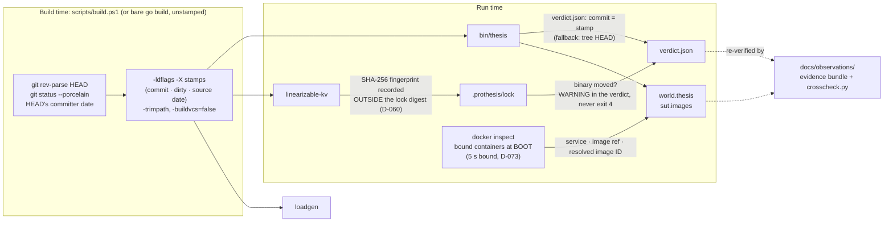

<div align="center">

# PRO-THESIS

### Chaos testing whose FAIL carries its witness, whose PASS has to be earned, and whose test is locked against quiet weakening.

PRO-THESIS boots your cluster from a Docker Compose file, drives clients against it, cuts the
network under load, and asks a checker whether any correct system could have produced what the
clients saw. It answers with an exit code that a CI job, or an AI agent working in a loop, can
act on without reading a word.

*A false PASS is the worst thing it can produce.*


<sub>A stale read it caught on 2026-09-28 (UTC), drawn from the verdict that run wrote, not redrawn by hand. [How the images on this page were made.](docs/media/README.md)</sub>

By **Senan Sumrein**.

</div>

---

<div align="center">

**[Why](#why-this-exists) · [Quick Start](#quick-start) · [First Five Minutes](#the-first-five-minutes) · [Four Answers](#four-answers) · [Costs](#what-it-actually-costs) · [Not Yet Proven](#what-is-not-yet-proven) · [Under the Hood](#under-the-hood) · [Authorship](#authorship-who-built-what)**

</div>

---

## Why this exists

A chaos test can lie in two quiet ways. It can pass because nothing was actually checked: the
fault landed after the load had ended, the checker crashed, a world never booted. And it can be
weakened by whoever is being tested: a smaller workload, a narrower fault budget, an oracle
switched off.

The second used to take a careless human. Now it takes only an AI agent told to make a failing
test pass, which may find that shrinking the test is easier than fixing the bug. PRO-THESIS is built
for that loop. It is meant to be run by something that reads nothing but an exit code, so that
exit code must be impossible to earn by accident or by cheating:

- **A FAIL names its witness, and the reference checker's FAIL is a proof.** `linearizable.kv`
  exhausts its search and names the operations where it broke, and an independent script can
  re-derive the violation from the raw history. The built-in oracles check crashes, panic logs,
  stuck operations, queue growth, recovery after HEAL and resource return to baseline; their FAIL
  names its evidence, and is not a search.
- **A PASS has to be earned.** Every planned world must run to ASSERT and be judged by at least one
  oracle, at the size the locked profile specifies. Anything less is never exit `0`.
- **The test is locked.** Changing a locked definition (the oracles, the fault budget, the
  workload command) is exit `4` before a container starts, until someone records a reason next to
  the change. What the lock cannot see is [listed too](#four-answers).

## What it does

- **Real clusters, isolated worlds.** The system under test boots from an ordinary Compose file.
  Worlds that run in parallel each get their own Compose project, ports and networks, so they
  cannot see or tear down one another (D-042).
- **Faults under load.** Seventeen fault kinds across the network, processes, clocks, disk I/O,
  memory and file descriptors, scheduled in milliseconds from the start of the client load.
  `role:leader` is bound at the moment of injection, through a probe the target declares.
- **A checker that proves.** `linearizable.kv` splits the history by key and searches for an
  order a correct register could have produced. A violation carries the exhausted search and a
  witness; a history it cannot soundly split is refused, not guessed at.
- **Refusal as a feature.** An oracle that crashes, hangs or emits malformed output, a probe the
  target lacks, a world no oracle judged: each is INCONCLUSIVE, loudly.
- **A lock on the gate.** Oracle definitions, ten configuration keys and every driver profile a
  run profile names are digested into `.prothesis/lock`. Drift is exit `4`.
- **Replayable worlds.** Each world is a content-addressed `.thesis` file holding its fault
  schedule as planned and as realized. `thesis replay -k 3` runs it again and counts.
- **Provenance.** A verdict names the commit its binary was built from; a world names the image
  ids it ran against.
- **Attribution.** `thesis diagnose` maps every recorded non-terminal outcome to a registry of
  known problems, and exits `2` if anything is unattributed.

---

## Quick start

Go 1.22 or later, and Docker Engine or Docker Desktop with Compose v2 running Linux containers.
Developed on Windows with Docker Desktop; CI runs on GitHub's Ubuntu 24.04 runners. These are the
commands CI runs.

```bash
go build -o bin/thesis ./cmd/thesis
go build -o testdata/kvfixture/bin/linearizable-kv ./cmd/thesis-oracle-linearizable
(cd testdata/kvfixture && go build -o bin/loadgen ./cmd/loadgen)

cd testdata/kvfixture
docker compose build
../../bin/thesis oracles verify        # the lock matches the committed definitions

../../bin/thesis run --profile linear --fault 'net.partition(role:leader)@3000..7500'
echo $?                                # 1: the planted defect, with a witness

KV_VARIANT=kvfixed docker compose build
KV_VARIANT=kvfixed ../../bin/thesis run --profile linear --fault 'net.partition(role:leader)@3000..7500'
echo $?                                # 0: the same fixture with the defect patched
```

A world takes 22 to 26 seconds on the build host, and the `linear` profile plans five; the
numbers are [below](#what-it-actually-costs).

You can also run the harness as a container, without Go and without this repository's
toolchain. The [`Dockerfile`](Dockerfile) builds an image carrying `thesis`, the reference
checker and the docker CLI, and drives the host's daemon through a mounted socket:

```bash
docker build -t pro-thesis:dev .
docker run --rm -v /var/run/docker.sock:/var/run/docker.sock \
  -v "$PWD:/project" -w /project/testdata/kvfixture \
  pro-thesis:dev run --profile linear --fault 'net.partition(role:leader)@3000..7500'
```

Measured that way on 2026-09-24, run `r_2026_09_24_b498`: exit 1 in 23.6 s, one witnessed
violation on key `k/0` where no linearization exists for its 612 operations after exhausting
2,129 states. Health probes go to `PROTHESIS_PROBE_HOST` rather than loopback, which is the
container's own; your driver and oracles are your executables and must be present under the
mounted project as `linux/amd64` binaries. [`docs/TARGETS.md`](docs/TARGETS.md) has the
constraints and D-087 has the two runs that were wrong first.

On Windows, `pwsh -File scripts/build.ps1` builds the same three binaries with build provenance
stamped in: the commit, the dirty flag and the commit's source date (D-070, D-072). `-Verify`
builds twice and proves the bytes identical. The compose and run steps are the same with
`.exe`. Bare `go build` also works and is what CI does; the stamp is what lets `verdict.json`
name the build rather than the tree it ran in.

Expect a warning about the checker binary on first run: the lock records the SHA-256 of the one
built on the author's machine, and a different build is reported, not refused (D-060).

For the second target (three unmodified etcd members, a pre-registered prediction, and the
verdict re-derived from etcd's own revision numbers), see
[`targets/etcd/README.md`](targets/etcd/README.md).

---

## The first five minutes

Five commands against the reference fixture, recorded live on 2026-09-28 (UTC) on the build host by
[`scripts/demo/first-five-minutes.ps1`](scripts/demo/first-five-minutes.ps1), in a single pass.
It is the second such pass: the first returned the same five exit codes and was replaced before
anything was committed, for a reason [recorded with the measurements](docs/EVIDENCE.md#the-first-five-minutes-measured).
Every line of output is the program's own. The recorder writes the prompt lines, `echo $?` and
the exit codes, and step 3's `sed` line stands for the one-line edit the recorder made itself; each
recording's header records what actually ran. The script asserted each exit code before moving on
and would have stopped at the first surprise. Playback shortens long pauses, pages long output
and colours lines by what they say; the recordings keep the real timestamps
([how](docs/media/README.md)).

**1. Catch the planted bug.** The fixture is a three-node Raft key-value store with one
deliberate defect: its leader keeps answering reads from a 5,000 ms lease, while a 600 ms election
timeout lets another node take over long before the lease runs out. Cut the leader off while
sixteen clients are running:

```bash
thesis run --profile linear --worlds 1 --seed 1 --fault 'net.partition(role:leader)@3000..7500'
```



Exit `1` in 25.6 s. The checker exhausted its search over the 542 operations on key `k/0`
(1,578 states) and found no order a correct register could produce. Its deepest attempt broke at
op 2493, a read that returned 15000136 when the register held 14000167; every possible order
places the write of 15000136 earlier. The write of 14000167, op 2480, had timed out, so it may or may not have
applied; the checker tried it both ways, and neither gives the history a valid order. The
diagram at the top of this page is drawn from this run's verdict. `--worlds 1` runs less than the
locked profile, which can turn a PASS into INCONCLUSIVE (step 4) and can never hide a FAIL.

**2. Patch it, and prove the fix.** The same profile, against the fixture built without the
defect:

```bash
KV_VARIANT=kvfixed thesis run --profile linear --fault 'net.partition(role:leader)@3000..7500'
```



Exit `0` in 112 s. Five worlds, the leader partitioned under load in every one, every world
judged, and the lock `ok`: a PASS at the size the lock specifies.

**3. Try to weaken the test.** Swap the workload for `smoke`, which by the fixture's own notes
finishes its 500 operations long before a fault window opens, and so can only ever produce a
clean history:

```bash
sed -i 's/--profile {profile}/--profile smoke/' prothesis.yaml
thesis run --profile linear --fault 'net.partition(role:leader)@3000..7500'
```


Exit `4` in 0.03 s, before a single container started. The lock covers `driver.cmd` (D-090),
and the report names exactly what moved. There are two ways forward: revert, or re-lock with
`thesis oracles lock --reason "…"`, which stores the reason in the lock file, where a reviewer
sees it in the diff.

**4. Test less, prove less.** Run the patched build for one world instead of the five the
profile specifies:

```bash
KV_VARIANT=kvfixed thesis run --profile linear --worlds 1 --seed 1 --fault 'net.partition(role:leader)@3000..7500'
```



The world passed; the run did not. Exit `2`, INCONCLUSIVE, with the lock marked `bypassed`. A
clean run smaller than the locked profile has not performed the test the lock describes, so it
cannot report PASS (D-059).

**5. Replay the failure.** Step 1 saved its world as a content-addressed `world.thesis`, with the
fault schedule as it was actually injected. Run it three more times:

```bash
thesis replay .prothesis/runs/r_2026_09_28_2071/world-0001/world.thesis -k 3 --expect linearizable.kv
```


Reproduced 3 of 3, exit `1`, in 66.1 s. Every attempt found a violation on `k/0`, each at
different operations: the schedule replays exactly, and the interleaving does not. That is why
the confirmation gate counts reproductions instead of assuming them (OQ-054).

---

## Four answers

The exit code is the product. Everything else in this repository exists so that the code can
mean what it says.

| Exit | Answer | What has to be true for the code to be emitted | How that was measured |
|---|---|---|---|
| `0` | **Pass.** Every planned world ran to ASSERT and no oracle found a violation. | At least one oracle judged every world, and every oracle returned `ok`. A world no oracle judged is `2`, never `0` (D-089). A run narrowed by `--worlds` or `--budget` below its locked profile cannot report this (D-059). | Asserted on every push to `master` by [`ci.yml`](.github/workflows/ci.yml): the fixture with its defect patched (`KV_VARIANT=kvfixed`), etcd with no faults, and etcd with linearizable reads under a leader partition. |
| `1` | **Fail.** An oracle proved a violation and named its witness. | `violations[]` in `verdict.json` carries the oracle, the witness operation ids and the proof. | Asserted on every push for the planted fixture defect and for etcd's serializable reads. Measured in the launching shell, on the line after the call, in [OBS-LIVE-001](docs/observations/2026-09-17-OBS-LIVE-001/record.md) (runs 2 to 4), [OBS-LIVE-002](docs/observations/2026-09-19-OBS-LIVE-002/record.md), and a sample of twenty fresh worlds (20 of 20; run ids in OQ-054). |
| `2` | **Nothing was proven.** The harness could not reach a verdict and refuses to guess. | An oracle that crashes, hangs, emits malformed output, or lacks the probe it needs returns `inconclusive`, never `ok`. One `inconclusive` takes the run to `2`; passing oracles cannot outvote it. A world that no oracle judged at all is `inconclusive` too. | `TestAWorldNoOracleJudgedIsInconclusiveNotPass` in [`internal/control/vacuous_pass_test.go`](internal/control/vacuous_pass_test.go); `TestExternalOracleReportsInconclusive`, `TestExternalOracleThatHangsIsKilledAndIsInconclusive`, `TestAnExternalInconclusiveTakesTheRunToExitTwo` in [`internal/oracle/external_test.go`](internal/oracle/external_test.go); `TestAvailabilityWithNoDeclaredProbeIsInconclusive`. Seen live: the two fixture-only oracles return `2` on every etcd world when enabled (OQ-063). |
| `4` | **Someone changed the test.** A locked definition moved without a recorded reason. | [`.prothesis/lock`](testdata/kvfixture/.prothesis/lock) digests every oracle definition, ten configuration keys (`driver.cmd`, `harness.health`, `harness.role_probe`, `oracles.builtin`, `oracles.dir`, `perturber.allow`, `perturber.budget`, `perturber.deny`, `profiles`, `search`), and every driver profile a run profile names (D-090). Every `thesis run` re-derives the digest before any container starts; a mismatch is `4`. Only `thesis oracles lock --reason "…"` moves it, and the reason is committed with the lock. | Adversarial probe A4 widens a lock-covered budget and requires exit `4` ([`scripts/adversarial.ps1`](scripts/adversarial.ps1)); [`internal/lock/lock_test.go`](internal/lock/lock_test.go), [`cmd/thesis/oracles_test.go`](cmd/thesis/oracles_test.go). CI runs `thesis oracles verify` against both committed locks before any live world. |

Two more codes are not verdicts. `3` (`BUDGET_EXHAUSTED`) means the run stopped before its
worlds were done, so do not merge on it. `5` (`CONFIG_ERROR`) means the configuration is invalid.

**What `4` does not cover.** The oracle *executables* are fingerprinted outside the digest. A
swapped, rebuilt or missing checker binary is a WARNING in the verdict
(`oracle_lock.executables_moved`), not exit `4`, because a routine rebuild would otherwise be an
incident that trains people to re-lock without reading (D-060; the measured gap is OQ-057). The
load generator's program is fingerprinted the same way, as `driver.cmd`, and is a warning for the
same reason (D-090). Neither the workload a driver compiles in for a profile name nor the
environment it inherits is covered (OQ-076). `thesis search --strategy` overrides the locked
`search.strategy` without drift and without narrowing the run, so such a run can still report
PASS with the lock `ok` (OQ-081). The lock is a review aid, not a sandbox: see
[Security model](#security-model).

---

## What it actually costs

**Money: nothing.** No account, no key, no cloud: it runs on your Docker daemon, against your
containers. The one option that calls out is `thesis search --strategy llm`, which asks an
OpenAI-compatible endpoint you configure for fault schedules and is billed by whoever runs that
endpoint. It is unvalidated (OQ-069).

**Time and disk**, measured over the ten worlds recorded above.
[`docs/EVIDENCE.md`](docs/EVIDENCE.md#the-first-five-minutes-measured) has every row, and the raw
file is [`measurements.json`](docs/media/demo/measurements.json).

| | Measured |
|---|---|
| One world, end to end | 25.6 s and 22.3 s (steps 1 and 4); replay attempts 21.7 to 22.2 s |
| Five worlds, one after another | 112 s (step 2) |
| BOOT: bring the cluster up and wait until it is healthy | 7.8 to 9.3 s, median 8.4 s |
| DRIVE: the client load, with the faults inside it | 7.9 to 8.1 s |
| HEAL, then QUIESCE | 1.7 to 3.3 s, then 2.0 s |
| Refusing a weakened test | 0.03 s, before any container starts |
| Disk per world | 2.5 to 3.3 MB, 80.4% to 87.9% of it the operation history |
| Docker build cache | 11.14 GB before the ten worlds, 11.14 GB after |

Build host: AMD Ryzen 9 9950X3D, Windows 11, Docker Desktop running Docker Engine 29.1.3 in a VM
of 8 CPUs and 30.1 GiB. The first world on an empty build cache is slower: 34 s in all, 20 s of
it BOOT, writing about 520 MB of cache (OQ-068). What the checker's search costs is not in these
numbers: the phase timings attribute 0 ms to ASSERT, and it has not been measured separately.

**What grows.** Nothing prunes the run corpus yet; the retention policy is parsed, validated and
enforced by nothing (OQ-070). On the build host the fixture's corpus holds 204 runs in 2.75 GiB.
Every run directory is evidence, and deleting one is final, so pruning is left to you.

---

## Evidence at a glance

| Claim | Measured |
|---|---|
| The planted defect is found | 20 of 20 fresh worlds FAIL with exit `1`; the one-sided 95% lower bound on the per-world rate is 0.86 (OQ-054). Asserted again on every CI push. |
| The fix is not accused | PASS with exit `0` on every CI push; five of five worlds in step 2 above. |
| It works on a system nobody here wrote | etcd v3.5.17, both arms as pre-registered: serializable reads FAIL, linearizable reads PASS. Re-derived from etcd's own revision numbers: 313 revision-stale reads in the failing arm, 0 in the passing one. |
| A violation is a proof, not a timeout | The checker reports its exhausted search with state and step counts, and `crosscheck.py` re-derives the witness from the raw history without it. |
| The suite passes on a second machine | Hosted Linux CI on Go 1.27.1 with the race detector and on Go 1.22.12, and a live job that asserts the exit code of each of its five runs. |

Every claim in this README, with the command or file that measured it:
[`docs/EVIDENCE.md`](docs/EVIDENCE.md).

---

## What is not yet proven

Stated here so a reader does not have to find it. [`docs/KNOWN-ISSUES.md`](docs/KNOWN-ISSUES.md)
digests the open weaknesses that bear on what a verdict means; every open entry is in
[`OPEN_QUESTIONS.md`](OPEN_QUESTIONS.md).

- **A PASS is not yet as strong as the design intends.** A driver that fails or is killed at the
  drain deadline is not folded into the world's outcome, so a truncated history is judged as if it
  were complete (OQ-077). Nothing checks that the load overlapped a realized fault, and
  `verdict.json` does not say how many faults landed or how many operations were judged (OQ-078).
  Until both close, a PASS means "every oracle that ran was satisfied", and the history it judged
  is trusted to be whole.
- **The guided search has never influenced a decision.** Across all 30 recorded Saboteur runs,
  `informed_selections` is `0`: the utility the tree exists to accumulate has never been read to
  choose anything, because an unvisited child scores `+Inf` and the budgets never exceeded the
  ladder (OQ-060; predicted analytically in D-015). Treat `thesis search` as a hand-written
  escalation ladder plus a probe sweep.
- **Operation-level shrinking has never completed end to end.** The shrinker reduces the
  workload and the driver executes the reduced plan verbatim (D-056), but against etcd the
  confirmation gate refused all three attempts at 1/3: a timing race is hit less often by a
  shorter trace, which breaks ddmin's monotonicity assumption. That is the gate working; it is not
  a shrunk trace carried through it (OQ-052, OQ-063).
- **The k/k confirmation gate assumes a determinism the target does not have.** Replaying the
  one committed regression world nine times reproduced it seven (OQ-054). That world,
  [`w_e952.thesis`](testdata/kvfixture/.prothesis/regressions/w_e952.thesis), is
  `net.partition(kv-n2)@3000..7500`, recovered by fault-level shrinking from a fourteen-fault
  schedule and confirmed 3/3 before entry. It was recorded on an earlier lifecycle, so its
  `sut.images` is empty and its DRIVE does not span its PERTURB.
- **`thesis bisect` has a unit test and no recorded live run.** The world file carries the image
  it ran against (D-070), which is what a sound bisect needs; nothing has been bisected yet.
- **Twelve of the seventeen fault kinds have never been realized in a recorded world.** Over the
  798 fixture world files on the build host, the kinds that actually landed are `net.latency`
  (368), `net.partition` (306), `net.loss` (211), `proc.pause` (80) and `proc.kill` (51). The other
  twelve (`net.reorder`, `net.duplicate`, `net.bandwidth`, `proc.restart`, `proc.slow`, and the
  whole clock, I/O, memory and descriptor families) have injectors and unit tests and have
  realized zero times. Only `net.partition` has a pre-registered, CI-asserted verdict attached to
  it.
- **The model-driven search strategy is unvalidated.** `thesis search --strategy llm` asks an
  OpenAI-compatible endpoint for each world's schedule and puts every proposal through the
  ordinary parser and perturber policy (D-075). It has not yet been run on a stamped build with a
  full profile. A proposal stream is not reproducible from a seed; the audit trail is
  `llm-proposals.jsonl` (OQ-069).
- **Two built-in oracles need things a third-party image may not have.** `no_unbounded_queue`
  needs a `/status` endpoint and `resource_return_to_baseline` needs a shell in the container.
  Both are disabled against etcd (OQ-063).
- **Determinism is not claimed.** The system under test runs in unmodified containers, so no
  finite sample proves a rate; the sample above bounds it. Image identity is stable only while the
  build cache lives: the first world after a cache prune records a different `sut.images` digest
  for an unchanged Dockerfile (OQ-068).
- **Three measurement upgrades are designed and pending**: run-relative witness paths, a
  retention policy for the run corpus, and a stratified sample whose unit is the world rather than
  the run. [`AGENTS.md`](AGENTS.md) carries their ground truth for whoever picks them up.

---

## Under the hood

**Lifecycle.** `BOOT → SEED → DRIVE → HEAL → QUIESCE → ASSERT → TEARDOWN`, with `PERTURB`
nested inside `DRIVE` (D-071): faults are injected at their `start_ms` and withdrawn at their
`end_ms` while the clients are still running. Every transition is written into the history
stream, so an oracle can say which phase a violation belongs to. HEAL withdraws every fault that
is still active and retries a withdrawal that failed, because a leaked `iptables` rule or a
stopped process poisons every later world on the host.

**Concurrency.** `thesis search` runs worlds in parallel, each in its own Compose project with
its own published ports and networks, so concurrent worlds cannot see or tear down one another
(D-042). The model-driven strategy runs one world at a time, because each proposal is coached by
the previous world's outcome.

**Faults.** `kind(target[, params])@start..end`, milliseconds from the start of DRIVE. Seventeen
kinds in six families: `net.partition`, `net.latency`, `net.loss`, `net.reorder`,
`net.duplicate`, `net.bandwidth`; `proc.kill`, `proc.pause`, `proc.restart`, `proc.slow`;
`clock.skew`, `clock.jump`; `io.latency`, `io.error`, `io.fill`; `mem.pressure`; `fd.exhaust`. The
last four families carry constraints worth reading before use (OQ-020, OQ-024, D-032b, D-033b).
Targets: a node id, `role:leader` / `role:follower` (bound at injection time through a probe the
target declares), an edge `n1<->n2` (always bidirectional), `minority(g)`, `majority(g)`,
`any(k, g)`, `group:*`. Network faults run as `iptables` and `tc`/`netem` in a privileged sidecar
joined to the node's network namespace; process faults are signals and container restarts;
`proc.slow` is a CFS CPU quota (D-031b). Every schedule is checked against the locked
`perturber.allow` / `deny` / `budget` before it runs.

**Oracles.** Six are built in (`no_crash`, `no_panic_log`, `no_stuck_op`, `no_unbounded_queue`,
`availability_after_heal`, `resource_return_to_baseline`), and any number of external checkers
can be driven over stdin/stdout as `prothesis.oracle_input/v1` → `prothesis.oracle_output/v1`.
The reference external oracle, `linearizable.kv`, is a per-key register linearizability search
that uses Herlihy-Wing locality to split the history by key and refuses any history it cannot
soundly partition. It is a small fraction of what a transactional checker like Elle verifies, and
says so.

**What a run leaves behind.** A `verdict.json` for the run, and for every world a canonical,
content-addressed `world.thesis`, a Jepsen-shaped `history.jsonl`, the phase transitions, exactly
what each external oracle was handed, the per-world result, the post-QUIESCE state and every
node's log. [`docs/EVIDENCE.md`](docs/EVIDENCE.md#what-a-run-leaves-behind) walks one committed
bundle file by file.

**Clustering.** `thesis cluster` is an advisory lens over the unattributed pool that
`thesis diagnose` reports. `extract` writes Tier 1 structural features per unattributed outcome;
`discover` runs DBSCAN and HDBSCAN over them and reconciles the two into CANDIDATE, CONTESTED and
NOISE outcomes (exit 2 when anything is CONTESTED); `taxonomy` places the candidates next to the
existing KP entries with Ward hierarchical clustering and flags probable sub-types, splits and
orphans. It is read-only against the corpus, never writes to `known-problems.yaml`, and promotes
nothing: a human still catalogues every new known problem.

**History checking.** `thesis history verify` applies the driver contract to a history file
offline, with no project, no Docker and no run: malformed lines, records that are neither a valid
operation nor a valid marker, operations with no `op_id`, an `op_id` naming two operations, a
completion with no invoke or one that precedes it, and timestamps that are not epoch nanoseconds.
An operation left open at the end is reported as INCONCLUSIVE rather than as a breach, because it
means the history stops before the answer rather than proving one. Run over both committed
corpora, 985 recorded histories and 9,549,942 operation records in 23.5 s: 924 clean, and not one
malformed line, duplicate `op_id` or negative interval anywhere. Of the 61 histories carrying an
unclosed operation, 50 belong to a world that never wrote a `result.json` and none to a world
judged pass (D-086). What it cannot check is the rule that matters most: whether a timeout was
recorded as `info` rather than `fail` is a claim about the target, not about the file.

**Provenance.** What a verdict can be traced back to, and where each fact is recorded:


```mermaid
flowchart LR
    subgraph Build["Build time: scripts/build.ps1 (or bare go build, unstamped)"]
        GIT["git rev-parse HEAD<br/>git status --porcelain<br/>HEAD's committer date"]
        LD["-ldflags -X stamps<br/>(commit · dirty · source date)<br/>-trimpath, -buildvcs=false"]
        GIT --> LD
    end

    LD --> T["bin/thesis"]
    LD --> OR["linearizable-kv"]
    LD --> LG["loadgen"]

    subgraph Run["Run time"]
        T -->|"verdict.json: commit = stamp<br/>(fallback: tree HEAD)"| V["verdict.json"]
        OR -->|"SHA-256 fingerprint recorded<br/>OUTSIDE the lock digest (D-060)"| LOCK[".prothesis/lock"]
        LOCK -->|"binary moved?<br/>WARNING in the verdict, never exit 4"| V
        IMG["docker inspect<br/>bound containers at BOOT<br/>(5 s bound, D-073)"] -->|"service · image ref · resolved image ID"| W["world.thesis<br/>sut.images"]
        T --> W
    end

    V -.->|"re-verified by"| OBS["docs/observations/<br/>evidence bundle + crosscheck.py"]
    W -.-> OBS
```

A wiring map of the commands, packages and refusal paths is in
[`docs/ARCHITECTURE.md`](docs/ARCHITECTURE.md).

---

## Targets

| Target | What it is | What it showed |
|---|---|---|
| [`testdata/kvfixture`](testdata/kvfixture/README.md) | A three-node Raft key-value store with exactly one planted defect: a 5,000 ms leader read lease against a 600 ms election timeout, so an isolated leader keeps answering reads from stale local state for up to 8.3× longer than it can be sure it is still leader. `-tags kvfixed` removes the defect and nothing else. | "Did the harness find the bug" is answerable, and answered on every CI push in both directions. |
| [`targets/etcd`](targets/etcd/README.md) | Upstream etcd v3.5.17, three members, unmodified image, no planted bug. The expected outcome of each arm was written down before the first run. | Both arms came out as predicted, but the pre-registered *mechanism* was wrong: the stale reads were on all three members from 69 ms in, so replication lag alone was enough and the partition was not needed. The record says so. |

Pointing the harness at a third system is documented in [`docs/TARGETS.md`](docs/TARGETS.md):
the configuration surface, the driver and history contracts, what the lock does and does not
cover, and the gaps that will bite.

---

## Status

Research software at `0.1.0-phase0`, under active development.

| | |
|---|---|
| Tests, hosted Linux CI | 1,566 pass · 3 skip · 0 fail on Go 1.27.1 with the Docker-backed tests and the race detector; 1,564 pass · 5 skip · 0 fail on Go 1.22.12 (first public commit, 2026-09-21) |
| Tests, build host | 37 packages ok · 0 not ok · 43 total (six packages carry no tests), `scripts/run-tests.ps1`, 2026-09-27; the same on a fresh copy of the tree with no `bin/` (OQ-084) |
| Live worlds, hosted Linux CI | Fixture defect found (exit 1), patched control passes (exit 0), etcd smoke passes, both etcd arms as pre-registered; every exit code asserted, not observed |
| Live worlds, recorded | Two observation bundles with an independent observer's cross-check; a twenty-world sample with every world file and exit code recorded (OQ-054); the ten worlds of the first five minutes above, with their measurements |
| Go | 1.22 minimum · one dependency (`gopkg.in/yaml.v3`) · the fixture has none |
| Platforms | Developed on Windows + Docker Desktop; CI on Ubuntu 24.04; the fault injectors target Linux containers |
| Requires | Docker. Almost nothing end to end works without it |

---

## How this was built

The author and AI coding agents built this together, under a written protocol. Other agent
sessions and a second model audited the work as it went, and it was then pointed at a system it
had not been built around.

### Who did what

This was a collaboration, and the repository does not try to draw a line through it. Every
commit is under the author's git identity, and its `Co-Authored-By` trailers record the AI agents
that worked on it; nothing in the history hides either party. The decisions, and the reasons for
them, are in the ledgers. The project was developed in a private repository; its full commit
history is available on request.

### The method

- **A written protocol binds the agents.** Never weaken a gate to make it pass; record every
  non-obvious choice in `DECISIONS.md`; log every requirement that cannot be met as written in
  `OPEN_QUESTIONS.md` instead of quietly relaxing it; ship a compiling binary at the end of every
  phase; never claim a number that was not measured. The phase briefs are in
  [`docs/protocol/`](docs/protocol/), and a wiring map of the commands, packages, and refusal paths
  is in [`docs/ARCHITECTURE.md`](docs/ARCHITECTURE.md).
- **Work is checked by someone other than its writer.** The adversarial conformance suite
  ([`scripts/adversarial.ps1`](scripts/adversarial.ps1)) re-derives truth from raw artifacts
  instead of trusting the tool's own verdict; every probe is built to be able to fail, and one
  probe exists to prove the others can. Separate agent sessions and a second model audit the code
  against its own claims, and their findings become ledger entries.
- **Live runs are recorded by an independent observer**, with the exit code read in the
  launching shell and the witness re-derived from the raw history
  ([`docs/observations/`](docs/observations/)).
- **Predictions are written down before the run.** The etcd target's expected outcome was
  pre-registered, and the record reports where the prediction was right and where its reasoning
  was not.
- **Every fix has the same shape.** A test that fails on the current code; the minimal change;
  then the change reverted to prove the test catches it.
- **The ledgers are enforced by a test.** A duplicated entry id, or a citation anywhere in the
  tree to an entry that does not exist, fails the suite (D-067).

---

## Security model

PRO-THESIS executes code named in the configuration file, by design. `driver.cmd`,
`harness.steady_state.probe` and every external oracle's `cmd:` run as your user; the sidecars
are privileged containers that run `iptables` and `tc` inside another container's network
namespace; the harness kills and pauses processes and creates and destroys containers, networks
and volumes.

`.prothesis/lock` is an integrity mechanism, not a sandbox. It tells a reviewer that the gate
moved; it confines nothing. It is designed for an adversary who wrote the system under test, and
possibly the harness's own configuration, and who would rather weaken a gate than fix a defect. It
is not designed to defend the host against a malicious `prothesis.yaml`.

**Do not run PRO-THESIS against a repository you would not run `make` in.** The weaknesses that
are open today, and how to report a new one, are in [`SECURITY.md`](SECURITY.md).

---

## The ledgers

- [`DECISIONS.md`](DECISIONS.md): every non-obvious choice, with what was rejected and why,
  D-001 through D-092.
- [`OPEN_QUESTIONS.md`](OPEN_QUESTIONS.md): every requirement that could not be met as written,
  every defect found, and what was measured about it, OQ-001 through OQ-084. Entries are never
  deleted; a resolution is appended.

---

## Authorship: who built what

PRO-THESIS was conceived, specified and adjudicated by its author, Senan Sumrein, and implemented
by AI coding agents working under his written specifications. The split is documented in the
tree, not asserted:

- **The author wrote the rules.** The base build directive, the phase briefs and addenda in
  [`docs/protocol/`](docs/protocol/), and the comprehensive test protocol
  ([`docs/protocol/VERIFICATION_PROTOCOL.md`](docs/protocol/VERIFICATION_PROTOCOL.md)) are his
  text. The doctrine every ledger entry cites (never weaken a gate; never claim an unmeasured
  number; INCONCLUSIVE is a verdict, not a failure) is his.
- **The author made the rulings.** Every binding decision in [`DECISIONS.md`](DECISIONS.md) was
  made or ratified by him; D-076 records the standing rules of the process itself, including which
  model may build and which may arbitrate ([`AGENTS.md`](AGENTS.md) section 9).
- **The agents wrote the code and tests** under those specifications. Every commit's
  `Co-Authored-By` trailer names the model exactly as the tool reported it: Claude Opus 5,
  Claude Opus 5 (1M context) and Claude Fable 5.1 through v0.1.0; Kimi Code CLI for the test
  protocol adoption D-081, the attribution system D-082/D-083 and the clustering engine D-084;
  Claude Opus 5 (1M context) for D-085 to D-088; Claude Opus 5.5 (1M context) from D-089 on,
  including the recordings and this page; Gemini 3.8 Flash on D-088, D-089 and D-092, and Gemini
  2.5 Pro on D-089. The author reviewed, redirected and
  rejected throughout: the pivot from "drive the corpus to zero inconclusive" to "every recorded
  refusal must attribute to a known problem" (D-082) was his instruction, and the system changed
  course because of it.
- **The evidence procedure is his.** The observation bundles
  ([`docs/observations/`](docs/observations/)) were recorded under his protocol, with exit codes
  read in the launching shell and witnesses re-derived from raw artifacts by an independent
  script.

---

## Development

```bash
go build ./... && go vet ./... && gofmt -l .
go test ./...
```

On hosts whose application-control policy blocks binaries in temporary directories,
[`scripts/run-tests.ps1`](scripts/run-tests.ps1) compiles the test binaries under `bin/` first
and runs both modules. Stamped release builds come from [`scripts/build.ps1`](scripts/build.ps1)
(D-070, D-072). The README's recordings come from
[`scripts/demo/first-five-minutes.ps1`](scripts/demo/first-five-minutes.ps1), and
`-RenderOnly` redraws them without Docker. [`AGENTS.md`](AGENTS.md) is the hand-off for an agent
or a person picking the work up: the doctrine, the development host, the state, and what is next.

---

## License

GNU Affero General Public License v3.0. See [`LICENSE`](LICENSE).

Versions published before 2026-09-27, up to and including commit `7fb03ba`, were released under
the Apache License 2.0, and copies of those versions keep that license (D-091).
