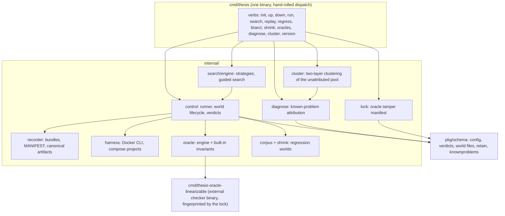
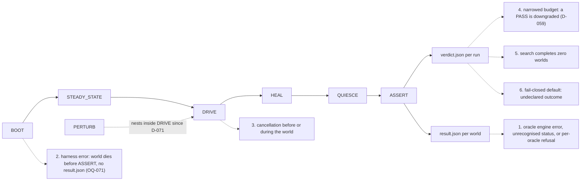
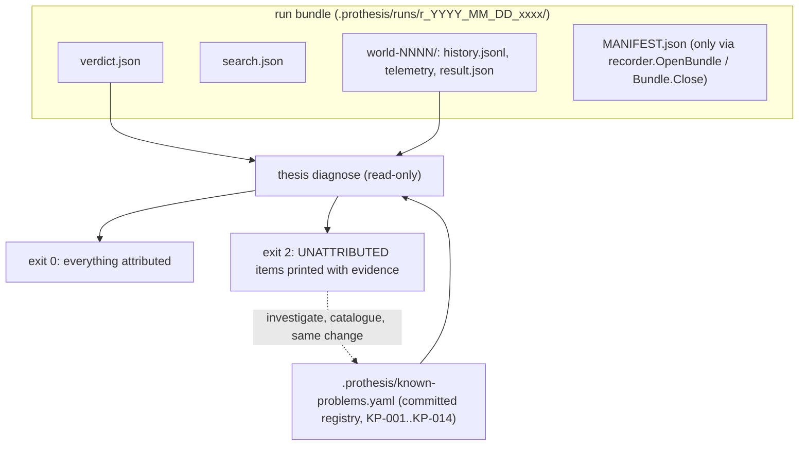

# Architecture

Generated from the code by reading it, not from memory of the design docs. Any edge found wrong
is a bug in this document and must be fixed in the same change that finds it. Cross-references:
the refusal census is OQ-072, the attribution layer is D-082, the retention gap is OQ-070.

## 1. Command and package wiring

`pkg/schema/retain.go` (`RetainPolicy.Keeps`) sits inside `SCHEMA` and has **zero callers**: the
retention policy is parsed, validated and defaulted, and enforced by nothing (OQ-070).

`thesis cluster` (extract, discover, taxonomy) reads the corpus only through `diagnose.Scan`, an
additive read-only twin of the diagnose walk, and writes derived reports
(`cluster_features.csv`, `cluster_manifest.json`, `cluster_report.yaml`, `taxonomy_report.yaml`,
all gitignored) under `.prothesis/`. It never writes to the registry and never promotes a
candidate; discover exits 2 when any CONTESTED outcome exists.

## 2. World lifecycle and the six ways a verdict becomes INCONCLUSIVE

Every one of the six is a refusal to judge, and since D-082 every recorded instance must
attribute to a known-problem entry or the diagnostic goes red.

## 3. Evidence and attribution dataflow

The loop at the bottom is the recursion: a new kind of refusal attributes to nothing, exits 2,
and is catalogued into the registry with its ledger citation in the same change. What is not yet
built: the census floor that makes corpus shrinkage loud in `internal/search/engine` (prerequisite
for the OQ-070 pruner), and the pruner itself, which when it lands must rename into
`.prothesis/runs/.trash/` and never unlink.
